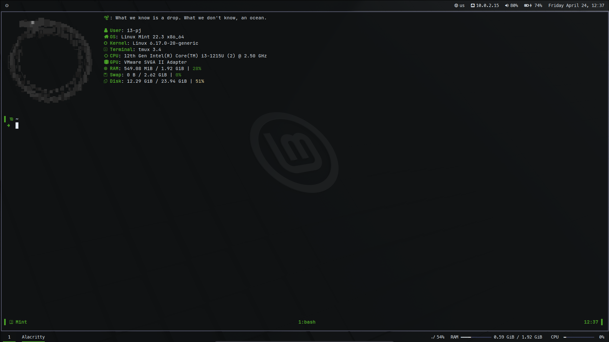

# 🌿 Lethal Mint Dotfiles

A stealthy, terminal-centric i3wm setup built for speed, minimal distractions, and a cohesive professional aesthetic. 

Designed on a Debian-based system, this "Lethal Mint" rice balances a dark, low-contrast UI with sharp, intentional highlights. The active window focus and file manager selections use a muted Steel Gray, leaving the vibrant Mint Green strictly for critical text, metrics, and progress bars.



## ⚙️ The Stack

* **Window Manager:** [i3](https://i3wm.org/) (Configured with a Stealth Charcoal/Steel hierarchy)
* **Compositor:** [Picom](https://github.com/yshui/picom) (Shadows and transparency)
* **Terminal:** [Alacritty](https://alacritty.org/) (GPU-accelerated)
* **Shell Prompt:** [Starship](https://starship.rs/) (Intelligent 2-line dashboard)
* **Multiplexer:** [Tmux](https://github.com/tmux/tmux)
* **Status Bar:** [Polybar](https://polybar.github.io/)
* **App Launcher:** [Rofi](https://github.com/davatorium/rofi)
* **File Manager:** [Yazi](https://yazi-rs.github.io/) (Rust-based, Vim keys, Image previews via Chafa)
* **Notifications:** [Dunst](https://dunst-project.org/) (Rounded corners, native Mint volume bars)
* **Text Editor:** [Nano](https://www.nano-editor.org/) (Floating title bar, syntax highlighting)
* **System Info:** [Fastfetch](https://github.com/fastfetch-cli/fastfetch)

## 🎨 Color Palette

| Element | Hex Code | Description |
| :--- | :--- | :--- |
| **Highlight** | `#4aa228` | Lethal Mint (Text, Progress Bars, Audio Popups) |
| **Active Focus** | `#585b70` | Steel Gray (Active Window Border, Yazi Selection) |
| **Inactive** | `#313244` | Deep Charcoal (Unfocused Windows, Yazi Separators) |
| **Background** | `#101213` | Void Black (Terminal & Desktop Background) |
| **Foreground** | `#cdd6f4` | Soft Silver (Primary Text) |

## 🚀 Installation

These dotfiles are structured to be managed with [GNU Stow](https://www.gnu.org/software/stow/). 

**1. Clone the repository:**
```bash
git clone [https://github.com/YOUR_USERNAME/dotfiles.git](https://github.com/YOUR_USERNAME/dotfiles.git) ~/dotfiles
cd ~/dotfiles

**2. Install GNU Stow (if not already installed):**

```Bash
sudo apt install stow
```

**3. Symlink the configurations:**
Use stow to automatically create symlinks in your ~/.config directory. For example, to install the i3 and Alacritty configs:

```bash
stow i3
stow alacritty
```
(To install everything at once, you can run stow * inside the dotfiles directory).

## 🎵 Audio & Volume Control
The volume keys are mapped to a custom pactl script that interfaces directly with Dunst. Pressing the volume keys triggers a sleek, rounded Mint Green progress bar that replaces traditional clunky popups.

## 📁 File Management
Yazi is highly optimized for this environment:

* Requires chafa, batcat, ffmpegthumbnailer, poppler-utils, and jq for terminal-based file previews.

* Theme is tightly integrated with the i3 window border hierarchy.
